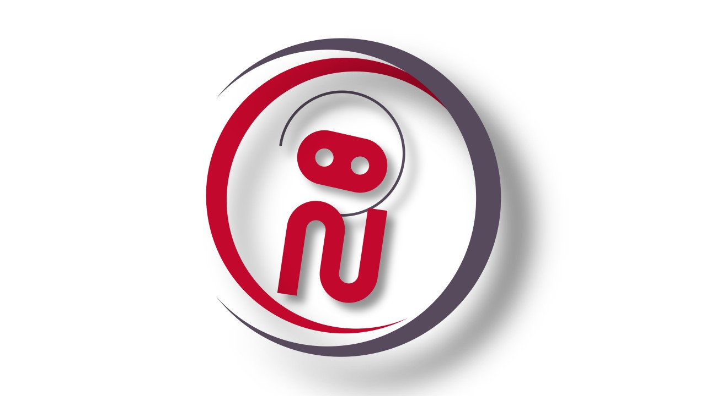
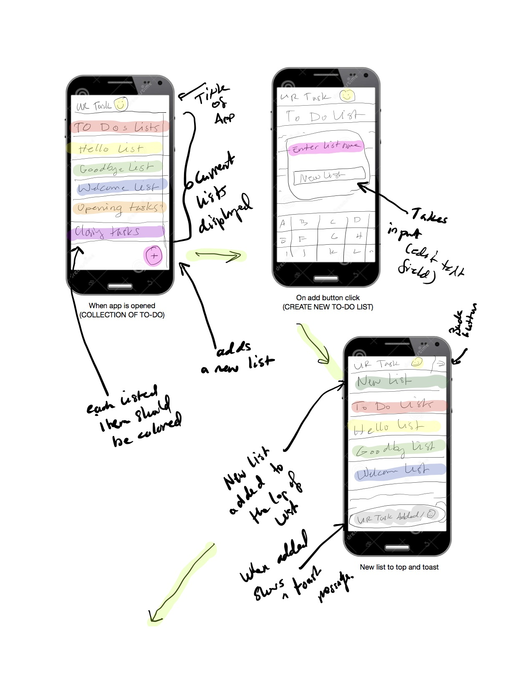
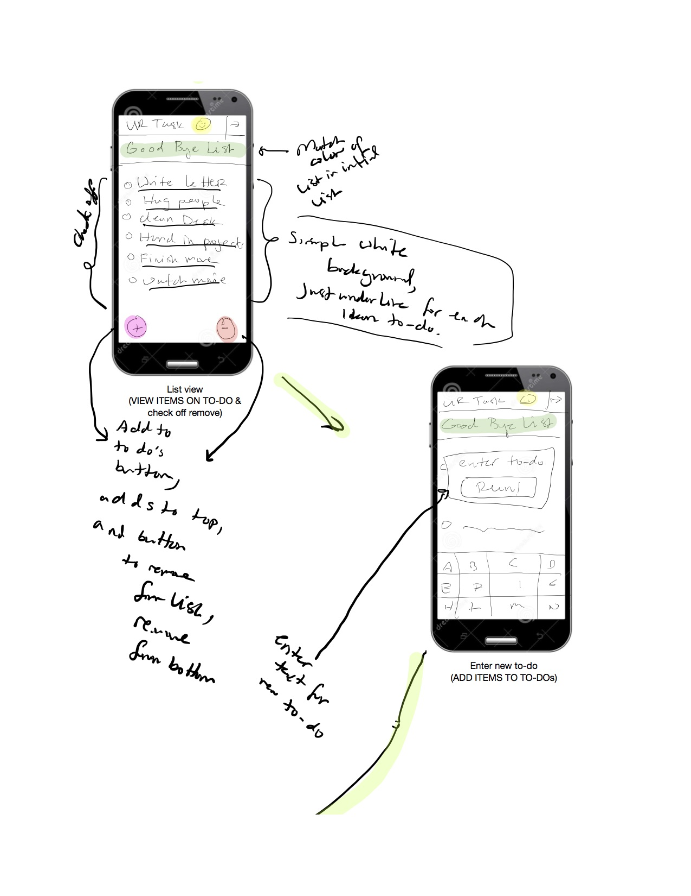
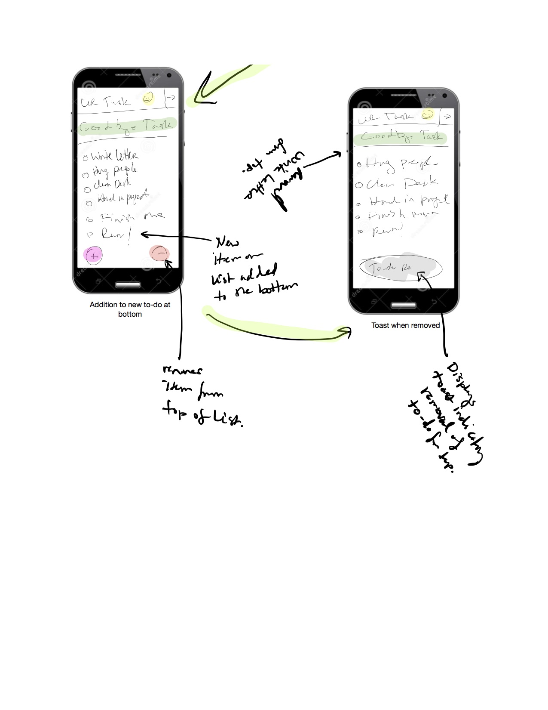
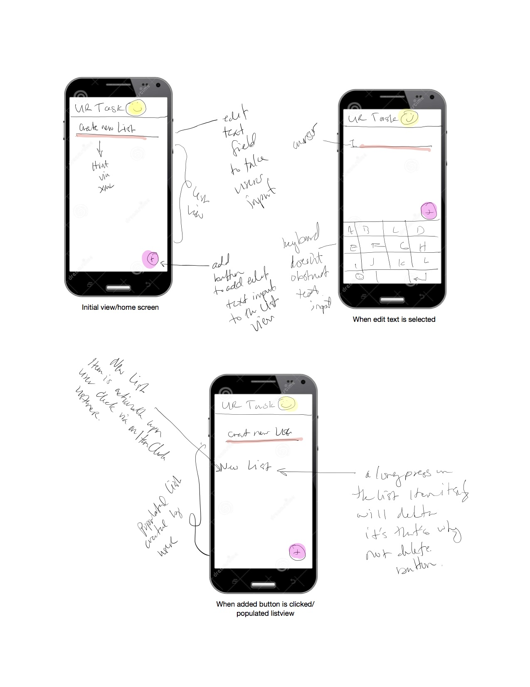
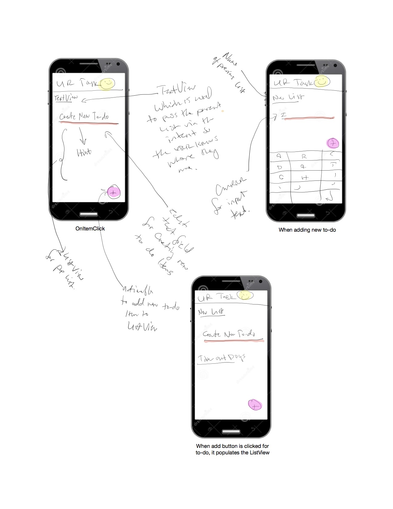
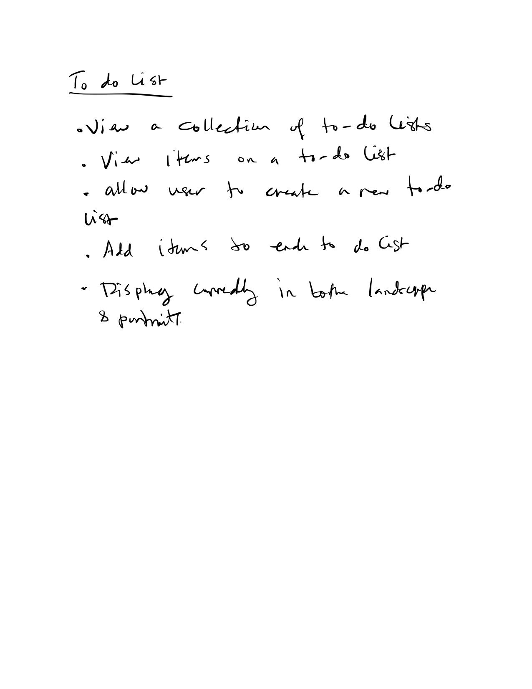

# 

##READ ME: TO-DO LAB

###Welcome to my app: URTask READ ME
###Check out the prototype for URTask
####Below you'll find a breakdown of the apps functions based on the requirments 
####For the requirments check out the breakdown just below the prototyped image!

##Actually, just kidding, here's the more realistic prototype ;-)

## Requirements

Your app must:

- **Implement the prototype** you created
- **View a collection of to-do lists**
- **View items on a to-do list**
- Allow the user to **create a new to-do list**
- **Add items** to each to-do list
- **Display correctly in both landscape and portrait orientations**

**Bonus:**

- Show an error message if invalid input is given
- Allow the user to check off and remove completed items
- Add an item detail screen that allows the user to give an optional description for each item.

---
##My breakdown of the Requirments

